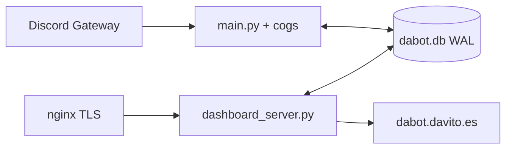

# Arquitectura de Dabot

Copia de lo que corre en el VPS. Dos procesos, un SQLite WAL, nginx delante.

## Procesos

| | Bot | API |
| --- | --- | --- |
| Compose | `dabot-bot` | `dabot-api` |
| Entrypoint | `python main.py` | `uvicorn dashboard_server:app --host 0.0.0.0 --port 8090` |
| Health | `/tmp/bot_alive` tocado por el bot; stale si > 60 s | `GET /healthz` (SELECT 1) |
| Bind | no publica puerto | `127.0.0.1:8090` |
| User | gosu → uid 1000 `dabot` | igual |

El Dockerfile es el mismo (`python:3.11-slim`, ffmpeg/libopus, gosu). `docker-entrypoint.sh` hace `chown` de `data/` y `logs/` y baja privilegios.

## Arranque del bot

`.env` → `require_runtime_env("bot")` → `SUPER_OWNER_ID` → `patch_permissions` → intents explícitos (no `Intents.all()`) → `ConfigManager` → `bot.db.setup()` (WAL) → traductor de slash → `load_extensions()` → `bot.start`.

`load_extensions()` recorre `cogs/*.py` y **salta** `tts` y `music`. Hoy hay 68 cargados y `tts.py` en disco sin cargar. Si el proceso muere en bucle (`restart_state.json`, 3 reinicios / 60 s) se para. Un `RepairEngine` puede restaurar backups de código si un arreglo automático dejó el árbol roto.

`main.py` parchea `Context.send`, followups y `Message.edit` para traducir según el idioma del guild. Watchdog a ~1,15 s: si un slash no ha hecho ACK, hace `defer`.

## Config viva

No es un YAML por guild.

- Lectura/escritura: JSON en la tabla `guild_configs`.
- Plantilla: `configs/default.yaml` (la única YAML que viaja en el repo).
- `utils/config.py` define el esquema por defecto (mod, levels, logs, tickets, chatbot, economy, …).
- El panel lee y escribe ese JSON; hay `config_revisions` para historial.

Bot y API abren el **mismo** `DATABASE_PATH` (`/app/data/dabot.db` en Compose) con `journal_mode=WAL` y `busy_timeout`.

Hay ~100 tablas: sesiones web, OAuth state, tickets y mensajes, infracciones, niveles, economía, alts, verificación, backups, runtime (`bot_runtime` para el badge de la home), etc.

## Panel y auth

`dashboard_server.py` (~6125 líneas) sigue concentrando la mayoría de rutas. Extraído:

- `webapp/routers/health.py` — `GET /healthz`, `GET /api/healthz`
- `webapp/routers/status.py` — `GET /api/status` (heartbeat SQLite + ping Discord REST, caché ~55 s)

OAuth2 Discord: PKCE S256, `code_verifier` en `web_oauth_states`, cookie de sesión en `web_sessions`. CSRF: cookie `csrf_token` vs header `x-csrf-token` en mutaciones `/api/*`. Cabeceras: nosniff, DENY frames, HSTS, CSP, COOP.

Páginas estáticas desde `templates/`. JS/CSS en `static/`. i18n del panel en `static/i18n/{es,en,…}.json`.

## IA

`cogs/chatbot.py` enruta a un pool (Gemini, Groq, Cohere, OpenAI, OpenRouter, HF, Cloudflare) según complejidad y si el guild es premium. `utils/gemini_client.py` rota claves y enfría 429.

Tools que ve un usuario normal: búsqueda, imagen, crypto, clima, Wikipedia, QR, recordatorios, status de web (con bloqueo SSRF). Owner: `read_file` / `list_dir` vía `utils/llm_fs.py` (allow-list `cogs/`, `utils/`, docs, etc.; jamás `.env`, `data/`, `configs/`). No existen tools de escritura ni de `systemctl`.

## Observabilidad

- Logs diarios: `logs/session_YYYY-MM-DD_HH-MM-SS.txt`, rotan a medianoche.
- `bot_runtime` (id=1): latencia gateway, guilds, users, versión, username. Lo usa `/api/status`.
- `scripts/sync_logs_gdrive.py` sube logs; no forma parte del camino feliz del bot.

## Red

nginx (fuera de este repo, stack del VPS) termina TLS en `dabot.davito.es` y hace proxy a `127.0.0.1:8090`. CORS del API: `dabot.davito.es` y `davito.es`.

## Secretos

Solo `.env`. El ejemplo lista nombres, nunca valores. Pepper de privacidad: `PRIVACY_SECRET_PEPPER` o `SESSION_SECRET`; si faltan, HMAC usa un nonce de proceso (se avisa al arrancar).
