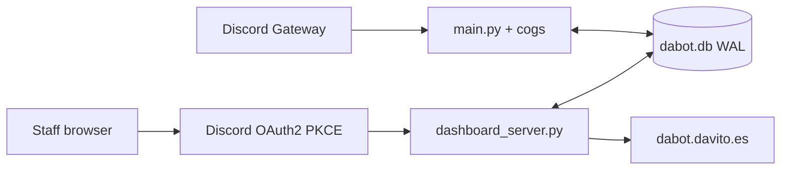

# Arquitectura de Dabot

La copia de producción. Dos procesos en Docker: el bot (`python main.py`) y el panel (`uvicorn dashboard_server:app`). Comparten SQLite en WAL.

## Arranque del bot

1. `load_dotenv()` — `DISCORD_TOKEN`, `SUPER_OWNER_ID`.
2. `patch_permissions` para el owner.
3. `commands.Bot` con prefix por guild (`ConfigManager`), intents all, i18n.
4. `bot.db.setup()`, traductor de slash, `load_extensions()` recorre `cogs/*.py` (salta `tts` y `music`).
5. Heartbeat en `/tmp/bot_alive` + tabla `bot_runtime`. Guardia anti crash-loop (`restart_state.json`) y `utils/ai_repair.py`.

## Panel

FastAPI con OAuth2 + PKCE S256, state en SQLite, cookie de sesión, CSRF en `/api/*`, CSP/HSTS. Plantillas en `templates/`. Rutas de producto: `/`, `/dashboard`, `/servers`, `/niveles`, `/normas`, `/verify`, `/premium`, `/cuenta`. Health: `GET /healthz`.

## Datos

- Plantilla: `configs/default.yaml`.
- Overrides: `configs/<guild_id>.yaml` (no van al repo público).
- Estado: SQLite (`utils/database.py`) — users, economy, infractions, tickets, verification, sessions web, premium.

## i18n

`langs/{es,en,fr,de,it,pt,ja,ko,zh}.json`. `main.py` parchea `Context.send` e `InteractionResponse.send_message` para que los cogs viejos salgan traducidos sin saberlo.

## IA

`cogs/chatbot.py` reparte entre Gemini, Groq, Cohere, OpenAI, OpenRouter, Hugging Face y Cloudflare. `utils/gemini_client.py` rota claves y modelos; un 429 enfría esa clave.

## Docker

| Servicio | Comando | Health |
| --- | --- | --- |
| `bot` | `python main.py` | `/tmp/bot_alive` reciente |
| `api` | uvicorn `:8090` | `GET /healthz` |

El puerto de la API solo escucha en localhost. nginx publica `dabot.davito.es`.
