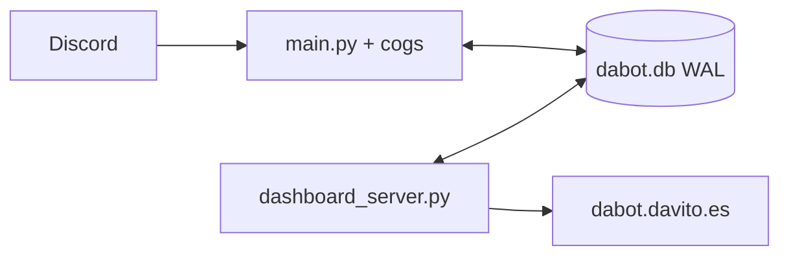

# Arquitectura de Dabot

Dos procesos, un SQLite WAL.

- Config **viva**: JSON en `guild_configs`. YAML es plantilla/legado.
- `tts` no se carga. `music` no está en el árbol.
- Liveness API: `webapp/routers/health.py` (`GET /healthz`).
- Estado del bot para la home: `webapp/routers/status.py` (`GET /api/status`, heartbeat + ping Discord).
- Tools LLM: búsqueda e info públicas. Lectura de código solo owner (`utils/llm_fs.py`). Sin write/restart.
- Compose: `bot` + `api`. El contenedor no corre como root (gosu → uid 1000).
